This task is all about topic modeling in large set of short text documents. I am trying to cluster the documents according to the frequency of word counts through TF-IDF and later through the cosine distance between words. One of the major goal is to find the optimum value of k to get the right number of clusters and visualise the most frequent words to get the topic of different clusters.  


Lets start with importing the required packages  


```r
library(tm)
library(SnowballC)
library(wordcloud)
library(ggplot2)
library(ggdendro)
library(dplyr)
library(cluster)
library(HSAUR)
library(fpc)
library(skmeans)
library(plyr)
library(gplots)
library(stats)
library(philentropy)
library(networkD3)
library(ape)
library(RColorBrewer)
library(wesanderson)
library(wordcloud2)
library(treemapify)
library(knitr)
library(kableExtra)
```

#### Data Preparation:  

Here after reading the documents I am removing the symbols, punctuations exta white spaces to clean up the corpus. I am also converting the whole text in lower case, removed stopwords, stemmed the words to there root.This way I have removed unnecessary words and junked characters to cluster them accurately. 


```r
setwd("D:/Ratul/MyGit/Data-Visualisation/TextAnalytics/")


corpus <- VCorpus(DirSource("corpus", recursive = TRUE, encoding = "UTF-8"), 
                   readerControl = list(language = "eng"))

# Cleaning the corpus..
toSpace <- content_transformer(function (x , pattern ) gsub(pattern, " ", x))
corpus <- tm_map(corpus, toSpace, "/")
corpus <- tm_map(corpus, toSpace, "/.")
corpus <- tm_map(corpus, toSpace, "@")
corpus <- tm_map(corpus, toSpace, "\\|")

# Converting all text to lower case. removing stop words and punctuations
corpus <- tm_map(corpus, content_transformer(tolower))
corpus <- tm_map(corpus, removeWords, stopwords("english"))
corpus <- tm_map(corpus, removePunctuation)

# Remove numbers, letters and stemming
corpus <- tm_map(corpus, removeNumbers)
corpus <- tm_map(corpus, removeWords, c(letters)) 
corpus <- tm_map(corpus, stemDocument)
```

#### Term Document Matrix Creation and Sampling of the data
  
After cleaning up the data I will create the Document Term Matrix where each word represent by a column and each document represent by a row. To reduce the sparsity I have tried to increase the threshold but it will remove important terms, so I decided to stick with the 0.99 percent level. I have removed the rows containing zeros to dense the matrix. As the corpus size is large I am taking a sample of 40 percent and will try to get the clusters out of that data.  


```r
corpus.dtm <- DocumentTermMatrix(corpus, 
                                  control = list(
                                    weighting = function(x) 
                                      weightTfIdf(x, normalize = TRUE)))

sparsity_threshold = 0.9995
corpus.dtm<-removeSparseTerms(corpus.dtm, sparsity_threshold)
corpus.dtm.mat <- corpus.dtm %>% as.matrix()

# remove any zero rows
corpus.dtm.mat <- corpus.dtm.mat[rowSums(corpus.dtm.mat^2) !=0,]


set.seed(62)
percent = 40
sample_size = nrow(corpus.dtm.mat) * percent/100

corpus.dtm.mat.sample <- corpus.dtm.mat[sample(1:nrow(corpus.dtm.mat), 
                                                 sample_size, replace=FALSE),]
```

#### Find Optimum Cluster through Elbow Method

I will now try to apply the elbow method to find the optimum k from the data after creating the Term Document Matrix and applying different values of K ranging from 1 to 30. I will plot the cost for every K value and try to find the elbow - 


```r
corpus.tdm <- TermDocumentMatrix(corpus, control = 
                                    list(weighting = function(x) weightTf(x)))
corpus.tdm<-removeSparseTerms(corpus.tdm, 0.999)
corpus.tdm.sample <- corpus.tdm[, rownames(corpus.dtm.mat.sample)]
corpus.tdm.sample.mat <- corpus.tdm.sample %>% as.matrix()

cost_df <- data.frame()

#run kmeans for all clusters up to 100
for(i in 1:20){
  #Run kmeans for each level of i, allowing up to 100 iterations for convergence
  kmeans<- kmeans(x=corpus.dtm.mat.sample, centers=i, iter.max=100)

  #Combine cluster number and cost together, write to df
  cost_df<- rbind(cost_df, cbind(i, kmeans$tot.withinss))

}

names(cost_df) <- c("cluster", "cost")


lm1 <- lm(cost_df$cost[1:10] ~ cost_df$cluster[1:10])
lm2 <- lm(cost_df$cost[10:19] ~ cost_df$cluster[10:19])
lm3 <- lm(cost_df$cost[20:30] ~ cost_df$cluster[20:30])
```

Plot the graph -  
  
  


```r
cost_df$fitted <- ifelse(cost_df$cluster <10, (lm1$coefficients[1] + lm1$coefficients[2] *cost_df$cluster),
                         ifelse(cost_df$cluster <20, (lm2$coefficients[1] + lm2$coefficients[2]*cost_df$cluster),
                                (lm3$coefficients[1] + lm3$coefficients[2] *cost_df$cluster)))

#Cost plot
ggplot(data=cost_df, aes(x=cluster, y=cost, group=1)) +
  theme_bw(base_family="Garamond") +
  geom_line(colour = "darkgreen") +
  theme(text = element_text(size=20)) +
  ggtitle("Reduction In Cost For Values of 'k'\n") +
  xlab("\nClusters") +
  ylab("Within-Cluster Sum of Squares\n") +
  scale_x_continuous(breaks=seq(from=0, to=100, by= 10)) +
  geom_line(aes(y= fitted), linetype=2)
```

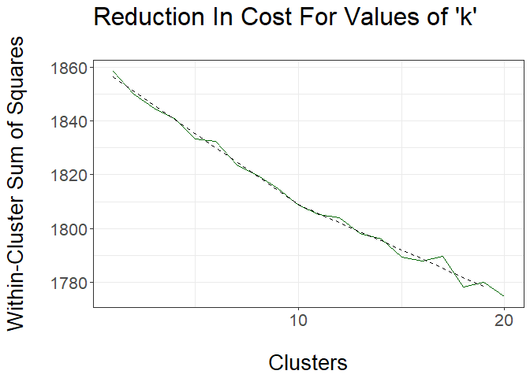<!-- -->

#### Observations:

* As seen in the above plot there is no clear elbow, and this method will not work to find the optimum k value


#### Apply K - Mean to Create Clusters

Though the elbow method fails to find the optimum k, I will try to apply K-Mean algorithm to get the clusters with k = 3, to see if it is able to show some patterns out of the data. I have manually inspect few documents randomly and identified some stopwords like "from","subject","organization","lines" and few others as they are present in almost all the documents. I will plot the word cloud for these clusters to see any patterns. 


```r
corpus.dtm.mat.sample.skm <- skmeans(corpus.dtm.mat.sample,3, method='genetic')

corpus.dtm.mat.sample.skm.cluster <- as.data.frame(corpus.dtm.mat.sample.skm$cluster)

colnames(corpus.dtm.mat.sample.skm.cluster) <- c("cluster")

stp.words <- c("can", "will", "get", "line", "use", "organ", 
               "subject", 'lines', 'organization',"write",
               "nntppostinghost","distribution","from")

m<- length(unique(corpus.dtm.mat.sample.skm$cluster))
set.seed(99)
par(mfrow=c(m,2))

# As I have found few words are very common in the email text I am removing those words 

for (i in 1:m) {
  
  
  #the documents in  cluster i
  cluster_doc_ids <-which(corpus.dtm.mat.sample.skm$cluster==i)
  
  #the subset of the matrix with these documents
  corpus.tdm.sample.mat.cluster<- corpus.tdm.sample.mat[, cluster_doc_ids]
  
  # sort the terms by frequency for the documents in this cluster
  v <- sort(rowSums(corpus.tdm.sample.mat.cluster),decreasing=TRUE)
  d <- data.frame(word = names(v),freq=v)
  rw_nm <- setdiff(rownames(d), stp.words)
  d <- d[rw_nm, ]
  
  # call word cloud function
  wordcloud(words = d$word, freq = d$freq, scale=c(3,.1), min.freq = 1,
            max.words=200, random.order=FALSE, rot.per=0.35, 
            colors=c('#feedde','#fdbe85','#fd8d3c','#e6550d','#a63603'))
  title(paste("cluster", i))
  
  
  barplot(d[1:10,]$freq, las = 1, names.arg = d[1:10,]$word,
          col ="#e6550d", main =paste("Most frequent words - Cluster ", i),
          ylab = "Word frequencies", width = 0.05, border = "red", las=2)
}
```

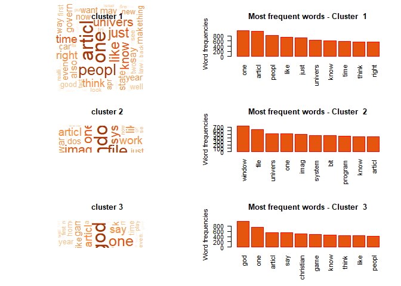<!-- -->

#### Observations:

* We can see dividing the corpus into three clusters through K Mean failed to provide any concrete information about the data
* From the words present in the clusters we can see the presence of words like God, game, windows, program, team from which we can say there might be further clusters with these topics

#### Hierarchical Clustering using Dendogram  
  
As the K Means failed to cluster the dataset properly and its also taking time to run I am now trying to use the hierarchical clustering using Dendogram Method.It will give the clustering as well as any hierarchical division if present in the data.


```r
# from philentropy library. Slower than dist function, but handles cosine similarity
sim_matrix<-distance(corpus.dtm.mat.sample, method = "cosine")

# for readiblity (and debugging) put the doc names on the cols and rows
colnames(sim_matrix) <- rownames(corpus.dtm.mat.sample)
rownames(sim_matrix) <- rownames(corpus.dtm.mat.sample)


# to create a distance measure for hierarchical clustering
dist_matrix <- as.dist(max(sim_matrix)-sim_matrix)

# hierarchical clustering
corpus.dtm.sample.dend <- hclust(dist_matrix, method = "ward.D") 

# plot the dendogram
# we hope to see some structure that reflects the finding of the kmeans algorithm
set.seed(2584)
par(mfrow=c(1,1))
plot(corpus.dtm.sample.dend, hang= -1, labels = FALSE,  main = "Cluster dendrogram", 
     sub = NULL, xlab = NULL, ylab = "Height")
```

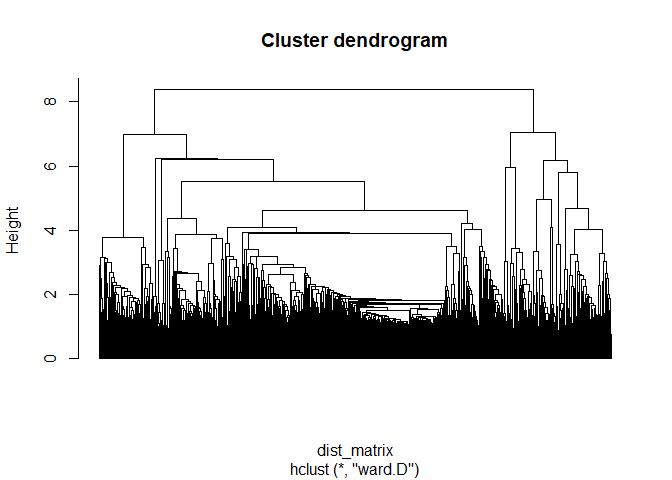<!-- -->

#### Observation:

* Seeing the dendogram we can see at the height of 4.2 there are around 9 to 14 clusters, I have tried with different value and ultimately settled down with 13 clusters, lets draw the boundary lines for the value of k as 13

```r
k =13
#h = 4.2

plot(corpus.dtm.sample.dend, hang= -1, labels = FALSE,  main = "Cluster dendrogram", 
     sub = NULL, xlab = NULL, ylab = "Height")

rect.hclust(corpus.dtm.sample.dend, k = k , border = "red") # h = h
```

<!-- -->

  
  
Lets get the number of documents in different clusters - 


```r
# number of clusters we wish to examine


# call the cutree function
# cutree returns a vector of cluster membership
# in the order of the original data rows
corpus.dtm.sample.dend.cut <- cutree(corpus.dtm.sample.dend,k = k ) # h = h

#number of clusters at the cut
m <- length(unique(corpus.dtm.sample.dend.cut))

# create a data frame from the cut 
corpus.dtm.sample.dend.cut <- as.data.frame(corpus.dtm.sample.dend.cut)

#add a meaningful column namane
colnames(corpus.dtm.sample.dend.cut) = c("cluster")

# add the doc names as an explicit column
corpus.dtm.sample.dend.cut$docs <- rownames(corpus.dtm.sample.dend.cut)

corpus.dtm.sample.dend.cut$docs<-lapply(corpus.dtm.sample.dend.cut$docs, tm::removeNumbers)

# Unlist the list assigned by rownames to $docs
corpus.dtm.sample.dend.cut$docs <- unlist(corpus.dtm.sample.dend.cut$docs)


# create a frequency table
corpus.dtm.sample.dend.cut.table <-table(corpus.dtm.sample.dend.cut$cluster, 
                                         corpus.dtm.sample.dend.cut$docs)

#displays the frequency data
corpus.dtm.sample.dend.cut.table
```

```
##     
##       doc
##   1  1315
##   2   302
##   3   238
##   4   331
##   5   234
##   6    92
##   7    47
##   8   128
##   9    38
##   10   20
##   11   37
##   12   49
##   13   25
```

* We can see the first cluster is large and may contain further segmentations, but here I am not dividing it further

#### Populate the Word Cloud -

Lets populate the word cloud and t bar chart showing the frequent words in different clusters -


```r
#number of clusters at the cut
m <- length(unique(corpus.dtm.sample.dend.cut$cluster))


set.seed(1478)
par(mfrow=c(2,2))

# for each cluster plot an explanatory word cloud
for (i in 1:m) {
  #the documents in  cluster i
  cut_doc_ids <-which(corpus.dtm.sample.dend.cut$cluster==i)
  
  #the subset of the matrix with these documents
  corpus.tdm.sample.mat.cluster<- corpus.tdm.sample.mat[, cut_doc_ids]
  
  # sort the terms by frequency for the documents in this cluster
  v <- sort(rowSums(corpus.tdm.sample.mat.cluster),decreasing=TRUE)
  d <- data.frame(word = names(v),freq=v)
  rw_nm <- setdiff(rownames(d), stp.words)
  d <- d[rw_nm, ]
  
  # call word cloud function
  wordcloud(words = d$word, freq = d$freq, scale=c(3,.1), min.freq = 1,
            max.words=200, random.order=FALSE, rot.per=0.35, 
            colors=c('#feedde','#fdbe85','#fd8d3c','#e6550d','#a63603'))
  title(paste("cluster", i))
  
  
  barplot(d[1:10,]$freq, las = 1, names.arg = d[1:10,]$word,
          col ="#e6550d", main =paste("Most frequent words - Cluster ", i),
          ylab = "Word frequencies", width = 0.05, border = "red", las=2)
  
}
```

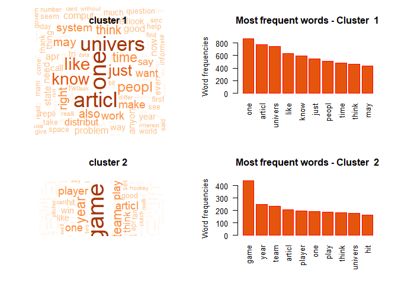<!-- -->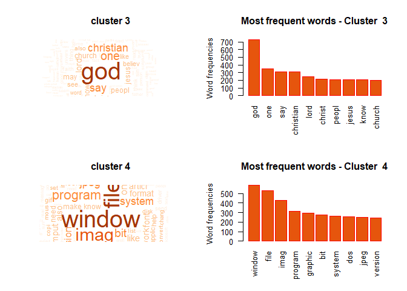<!-- -->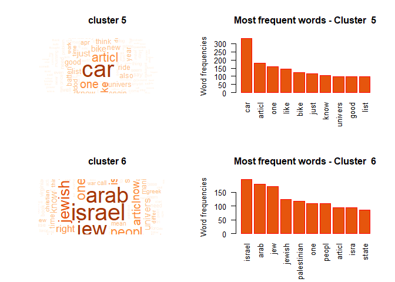<!-- -->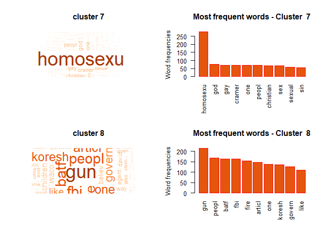<!-- -->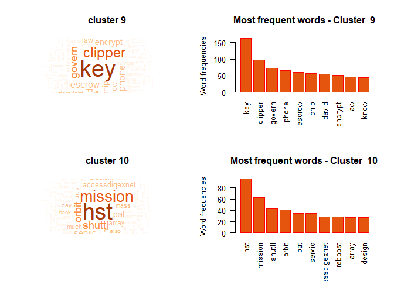<!-- -->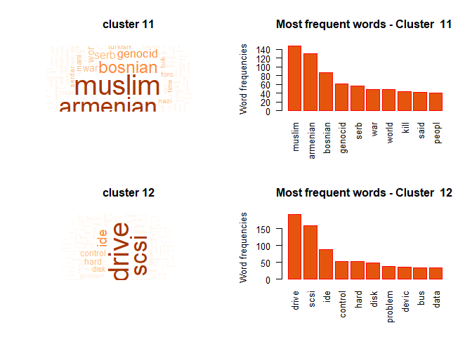<!-- -->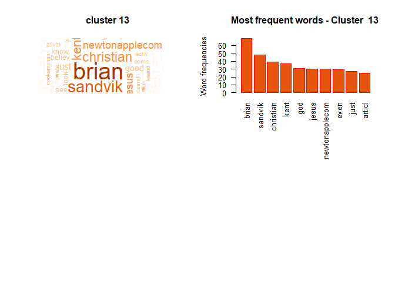<!-- -->

  
  

#### Treemap View of the Clusters:

Lets populate the TreeMap View of the most frequent 13 terms in each clusters -   
  


```r
#number of clusters at the cut
m <- length(unique(corpus.dtm.sample.dend.cut$cluster))

# number of terms per cluster to show
n <-7

#intialise an empty data frame
#fields initiliased with empty vectors
df <- data.frame(word=character(), freq = double(),cluster = integer())
# for each cluster plot an explanatory word cloud
for (i in 1:m) {
  #the documents in  cluster i
  cut_doc_ids <-which(corpus.dtm.sample.dend.cut$cluster==i)
  
  #the subset of the matrix with these documents
  corpus.tdm.sample.mat.cluster<- corpus.tdm.sample.mat[, cut_doc_ids]
  
  # sort the terms by frequency for the documents in this cluster
  v <- sort(rowSums(corpus.tdm.sample.mat.cluster),decreasing=TRUE)
  d <- data.frame(word = names(v),freq=v, cluster=i)
  
  rw_nm <- setdiff(rownames(d), stp.words)
  d <- d[rw_nm, ]
  
  # we might want scale so that high frequencies in large cluster don't predominate
  d[,2] <- scale(d[,2],center=FALSE, scale=TRUE)
  
  # take first n values only
  d <-d[1:n,]
  
  #bind the data for this cluster to the df data frame created earlier
  df<- rbind(df,d)
}
# the geom_treemap seems to only like vectors of values
df$freq <- as.vector(df$freq)

# simple function to rename the values in the cluster column as "cluster 1, cluster 2, etc"
clust_name<-function(x){
  paste("cluster", x)
}

# apply the function to the 'cluster' column
df$cluster<- as.character(apply(df["cluster"], MARGIN = 2,FUN =clust_name ))

gg<- ggplot(df, aes(area = freq, fill = freq, subgroup=cluster, label = word)) +
  geom_treemap() +
  geom_treemap_text(grow = T, reflow = T, colour = "black") +
  facet_wrap( ~ cluster) +
  
  scale_fill_gradientn(colours = terrain.colors(n, alpha = 0.8)) +
  theme(legend.position = "bottom") +
  labs(title = "The Most Frequent Terms in each cluster ", 
       caption = "The area of each term is proportional to 
       its relative frequency within cluster")

gg
```

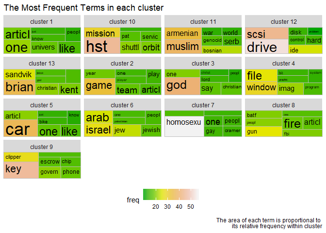<!-- -->

##### Print top 15 words for better view


```r
df = data.frame(cluster =integer(),topWords=character())
n = 15

for (i in 1:m) {
  #the documents in  cluster i
  cut_doc_ids <-which(corpus.dtm.sample.dend.cut$cluster==i)
  
  #the subset of the matrix with these documents
  corpus.tdm.sample.mat.cluster<- corpus.tdm.sample.mat[, cut_doc_ids]
  
  # sort the terms by frequency for the documents in this cluster
  v <- sort(rowSums(corpus.tdm.sample.mat.cluster),decreasing=TRUE)
  d <- data.frame(word = names(v),freq=v, cluster=i)
  
  rw_nm <- setdiff(rownames(d), stp.words)
  d <- d[rw_nm, ]
  
  # we might want scale so that high frequencies in large cluster don't predominate
  d[,2] <- scale(d[,2],center=FALSE, scale=TRUE)
  
  d1 =  data.frame("cluster" = unique(d$cluster), "topWords" = paste(d$word[1:n],collapse = ", "))
  
  df <- rbind(df,d1)  

}

df %>%
  kable() %>%
  kable_styling(bootstrap_options = "striped", full_width = F, position = "left") %>% 
  scroll_box(height = NULL)
```

<div style="border: 1px solid #ddd; padding: 5px; "><table class="table table-striped" style="width: auto !important; ">
 <thead>
  <tr>
   <th style="text-align:right;"> cluster </th>
   <th style="text-align:left;"> topWords </th>
  </tr>
 </thead>
<tbody>
  <tr>
   <td style="text-align:right;"> 1 </td>
   <td style="text-align:left;"> one, articl, univers, like, know, just, peopl, time, think, may, also, right, work, system, make </td>
  </tr>
  <tr>
   <td style="text-align:right;"> 2 </td>
   <td style="text-align:left;"> game, year, team, articl, player, one, play, think, univers, hit, win, time, just, know, like </td>
  </tr>
  <tr>
   <td style="text-align:right;"> 3 </td>
   <td style="text-align:left;"> god, one, say, christian, lord, christ, peopl, jesus, know, church, may, believ, like, see, articl </td>
  </tr>
  <tr>
   <td style="text-align:right;"> 4 </td>
   <td style="text-align:left;"> window, file, imag, program, graphic, bit, system, dos, jpeg, version, run, one, softwar, like, font </td>
  </tr>
  <tr>
   <td style="text-align:right;"> 5 </td>
   <td style="text-align:left;"> car, articl, one, like, bike, just, know, univers, good, list, engin, also, ride, batteri, new </td>
  </tr>
  <tr>
   <td style="text-align:right;"> 6 </td>
   <td style="text-align:left;"> israel, arab, jew, jewish, palestinian, one, peopl, articl, isra, state, now, right, univers, know, year </td>
  </tr>
  <tr>
   <td style="text-align:right;"> 7 </td>
   <td style="text-align:left;"> homosexu, god, gay, cramer, one, peopl, christian, sex, sexual, sin, clayton, say, men, paul, articl </td>
  </tr>
  <tr>
   <td style="text-align:right;"> 8 </td>
   <td style="text-align:left;"> gun, peopl, batf, fbi, fire, articl, one, koresh, govern, like, just, say, atf, think, children </td>
  </tr>
  <tr>
   <td style="text-align:right;"> 9 </td>
   <td style="text-align:left;"> key, clipper, govern, phone, escrow, chip, david, encrypt, law, know, sternlight, peopl, one, crimin, netcomcom </td>
  </tr>
  <tr>
   <td style="text-align:right;"> 10 </td>
   <td style="text-align:left;"> hst, mission, shuttl, orbit, pat, servic, accessdigexnet, reboost, array, design, mass, much, also, problem, articl </td>
  </tr>
  <tr>
   <td style="text-align:right;"> 11 </td>
   <td style="text-align:left;"> muslim, armenian, bosnian, genocid, serb, war, world, kill, said, peopl, univers, turkish, articl, europ, just </td>
  </tr>
  <tr>
   <td style="text-align:right;"> 12 </td>
   <td style="text-align:left;"> drive, scsi, ide, control, hard, disk, problem, devic, bus, data, know, dma, transfer, one, articl </td>
  </tr>
  <tr>
   <td style="text-align:right;"> 13 </td>
   <td style="text-align:left;"> brian, sandvik, christian, kent, god, jesus, newtonapplecom, even, just, articl, good, apr, want, everyon, one </td>
  </tr>
</tbody>
</table></div>


#### Observations:

We have found around 13 clusters -  
  
* Following are the details of each cluster - 
  * Cluster 1 : Generic cluster related to articles, universities, write ups
  * Cluster 2 : Related to Games
  * Cluster 3 : Related to theism and Christianity
  * Cluster 4 : Related to image files in computers
  * Cluster 5 : Something related to Car,bike and other vehicles
  * Cluster 6 : Related to Israel and Palestinian conflict 
  * Cluster 7 : Related to homosexuality
  * Cluster 8 : Related to US Governmeent Security with the presence of words like FBI, Gun
  * Cluster 9 : Related to cyber security as the presence of words like encrypt, key, chip
  * Cluster 10 : Something related to space shuttle and space missions
  * Cluster 11 : Related to Serbian Bosnian War
  * Cluster 12 : Related to drives in computers like scsi, floppy, hard disk
  * Cluster 13 : Again something related to religion and Christianity 


Thus we can see the clustering methods can bring hidden pattern in topics present in the corpus of documents based on the presence of words. Also it provides some hierarchical pattern like we can see in a broader sence there are clusters with Religion and Christianity, Computer Hardware and graphics, Automobiles, Games and Sports, Politics and issues of different middle east countries, scintific topics on space exploration and Encryptions. 
Though the above methodology only consider the word counts and frequencies, further clustering and topic modelling efficiencies can be improved by implementing semantics and word context.   
  
  
  
